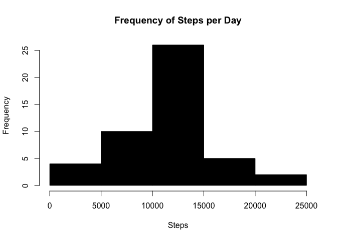
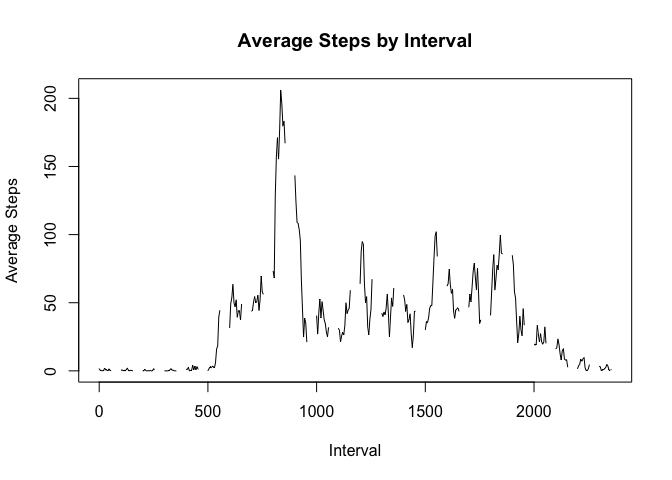
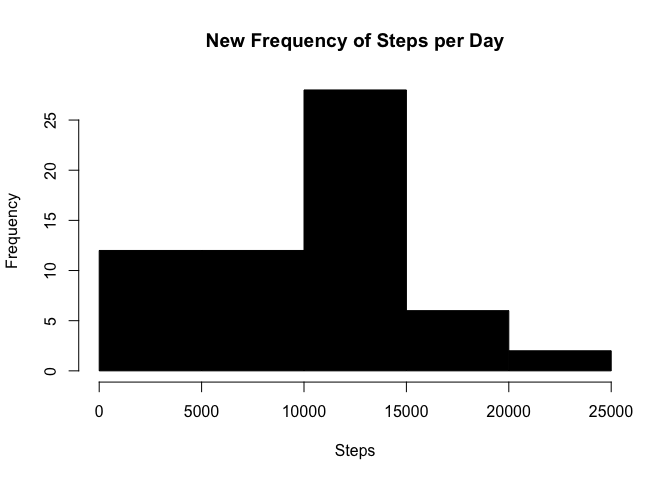
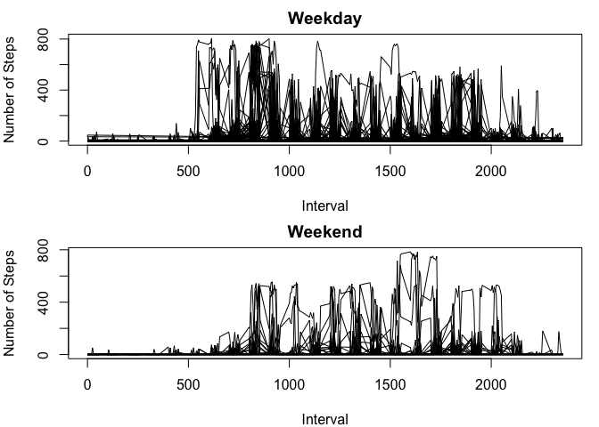

# Reproducible Research: Peer Assessment 1
### Berlyn Hubler
### 10/17/15

Stats package is required!


```r
library(stats)
```

## Loading and preprocessing the data

After the working directory is set, the data is read.


```r
full_data <- read.csv("activity.csv", header = TRUE, sep=',', na.strings = "NA", nrows=17568, stringsAsFactors = TRUE)
```


## What is mean total number of steps taken per day?

This code will produce a data frame with the date and total steps for that day.


```r
j <- 1
i <- 288

daily_total <- data.frame()

while (j <= 17568) {     
     data <- full_data[j:i,]
     total <- sum(data[,1])
     date <- full_data[j,2]
     daily_total <- rbind(daily_total,cbind(date, total))
     j <- i + 1
     i <- j + 288
}
```

Create a histogram of the daily steps:


```r
daily_steps <- daily_total[complete.cases(daily_total[,2]),]

hist(daily_steps[,2], ylab = "Frequency", xlab = "Steps", main = "Frequency of Steps per Day", col = "black")
```

 

```r
dev.copy(png, file = "daily_steps_histogram.png", height = 480, width = 480)
```

```
## quartz_off_screen 
##                 3
```

```r
dev.off()
```

```
## quartz_off_screen 
##                 2
```

### Mean Steps per Day:

```r
mean_steps <- mean(daily_steps[,2])

mean_steps
```

```
## [1] 10977.11
```

### Median Steps per Day:

```r
median_steps <- median(daily_steps[,2])

median_steps
```

```
## [1] 11144
```

## What is the average daily activity pattern?

This code will produce a data frame with the average steps for each time interval.


```r
i <- 0

int_avg <- data.frame()

while (i < 2356){
     int <- subset(full_data, subset=(interval == i))
     imean <- mean(int[,1], na.rm=TRUE)
     int_avg <- rbind(int_avg,cbind(i, imean))
     i <- i + 5
}

names(int_avg) <- c("interval", "mean")

head(int_avg)
```

```
##   interval      mean
## 1        0 1.7169811
## 2        5 0.3396226
## 3       10 0.1320755
## 4       15 0.1509434
## 5       20 0.0754717
## 6       25 2.0943396
```

```r
plot(int_avg$mean~int_avg$interval, type="l", ylab="Average Steps", xlab="Interval", main = "Average Steps by Interval")
```

 

```r
dev.copy(png, file = "avg_steps_interval.png", height = 480, width = 480)
```

```
## quartz_off_screen 
##                 3
```

```r
dev.off()
```

```
## quartz_off_screen 
##                 2
```

The time interval with the maximum average steps is:

```r
max_int <- subset(int_avg, subset = (mean == max(int_avg$mean,na.rm = TRUE)))

max_int[1,1]
```

```
## [1] 835
```

## Imputing missing values

The number of missing values:

```r
sum(is.na(full_data$steps))
```

```
## [1] 2304
```

Replace mising values with median daily value spread over the 5 minute intervals (should be ~4.73) and create new data set.


```r
NAval <- median_steps/2355

dat <- full_data

dat$steps[is.na(dat$steps)] <- NAval
```

Total steps per day with new data.


```r
j <- 1
i <- 288

day_total <- data.frame()

while (j <= 17568) {     
     data <- dat[j:i,]
     total <- sum(data[,1])
     date <- dat[j,2]
     day_total <- rbind(day_total,cbind(date, total))
     j <- i + 1
     i <- j + 288
}
```

Create a new histogram of the daily steps:


```r
day_steps <- day_total[complete.cases(day_total[,2]),]

hist(day_steps[,2], ylab = "Frequency", xlab = "Steps", main = "New Frequency of Steps per Day", col = "black")
```

 

```r
dev.copy(png, file = "new_daily_steps_histogram.png", height = 480, width = 480)
```

```
## quartz_off_screen 
##                 3
```

```r
dev.off()
```

```
## quartz_off_screen 
##                 2
```

### Mean Steps per Day:

```r
mean_day_steps <- mean(day_steps[,2])
mean_day_steps
```

```
## [1] 9673.784
```

### Median Steps per Day:

```r
median_day_steps <- median(day_steps[,2])
median_day_steps
```

```
## [1] 10414
```

### Both mean and median steps per day decreased with the addition of the missing values.

## Are there differences in activity patterns between weekdays and weekends?


```r
# Convert dates to date format.
dat$date <- as.Date(dat$date, "%Y-%m-%d")

# Get weekdays
days <- weekdays(dat$date)
dat <- cbind(dat, days)

# Set factor weekend/weekday
levels(dat$days)[1:2] <- "Weekday"
levels(dat$days)[4:6] <- "Weekday"
levels(dat$days)[2:3] <- "Weekend"

# Subset by weekend (endta) and weekend (dayta)
dayta <- subset(dat, subset=(days == "Weekday"))
endta <- subset(dat, subset=(days == "Weekend"))

# Setting global plot settings
par(mfrow=c(2,1), mar=c(4,4,2,1))

# plot weekday
plot(dayta$steps~dayta$interval, type="l", ylab="Number of Steps", xlab="Interval", main = "Weekday")

# plot weekend
plot(endta$steps~endta$interval, type ="l", ylab="Number of Steps", xlab="Interval", main = "Weekend")
```

 

```r
# save plot
dev.copy(png, file="weekend_weekday.png", height=480, width=480)
```

```
## quartz_off_screen 
##                 3
```

```r
dev.off()
```

```
## quartz_off_screen 
##                 2
```

### Weekend steps start and peak later in the day, weekday seems to be consistent, but tapers off slightly toward the end of day.
